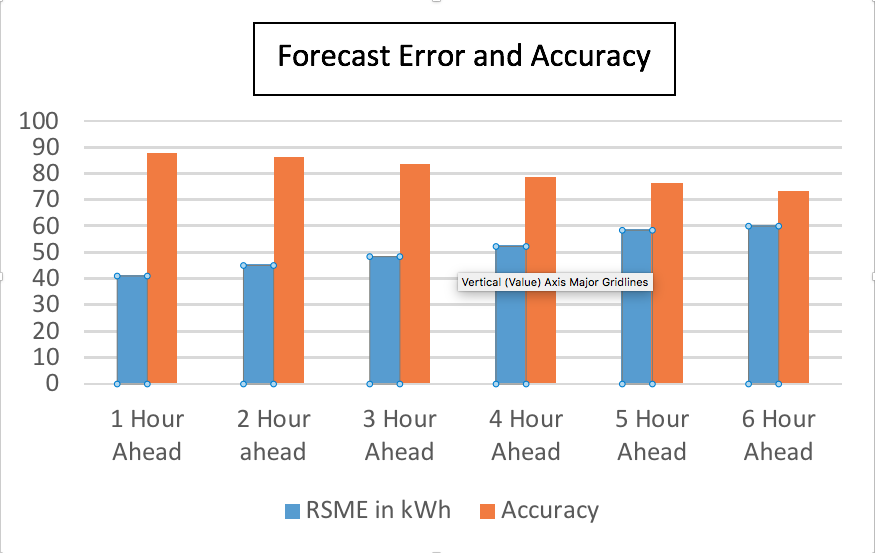
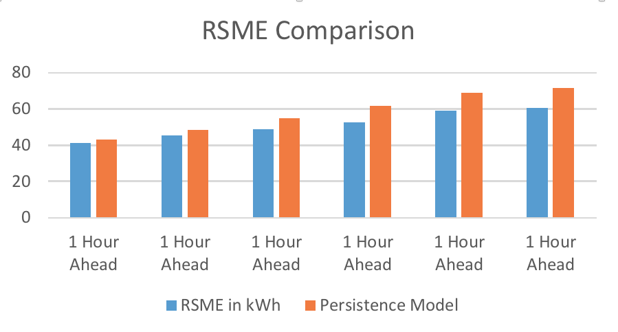
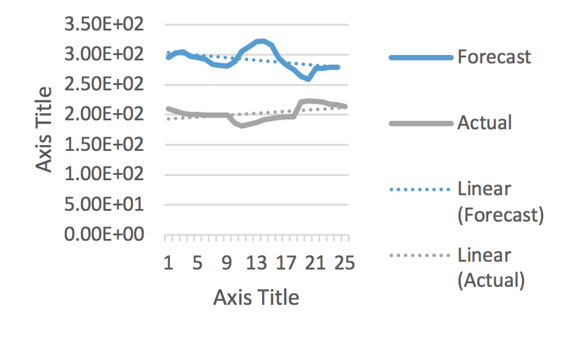

LOAD FORECASTING

The file 'Load Forecasting.html' shows the code for prediction in read only form.

-	I have used Random Forest which takes Temperature, Humidity, and Pressure as factors to produce 1-6 hour ahead load 	forecast for Engineering and Computer Science North Building at The University of Texas at Dallas. 
-	The forecast is then compared with the actual data and the persistence model. The error measures including Root Mean 	 Square Error and Mean Absolute Error have been calculated.

Technologies Used: Python, Pandas, numpy, sklearn, matplotlib

Here orange bar represents the Accuracy in terms of percentage and Blue bar represents the RSME in Kwh. We can infer that accuracy is decreasing with respect to duration of the forecast.

Comparison between random forecast and persistence model

Looking at the forecast period of 24 hours and comparing it with the actual load, it can be seen that the forecast is overestimating the load. 

Linear means the persistence model.

-	We calculated the RSME and MAE for the various time periods for the obtained forecast from ransom Forest. 
-	From the chart below it can be seen that our process gave lower errors as compare to persistence model for the all 
	1-6 Hour forecast. 
-	There is a pattern to observe as the time increases, the percentage errors increases for both the methods

